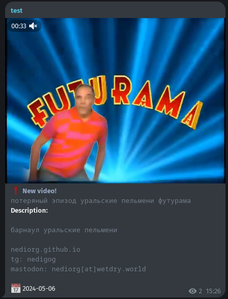

A simple telegram bot that checks the YouTube channel for new videos and, if there are any, sends them by id
Written using yt-dlp, messages are sent using regular POST requests

## Demo



## Installation
1. Clone repository
```
git clone https://github.com/Nediorg/VideoChecker
```
2. Install packages
```
pip install install -r requirements.txt
```
3. Write your config in src/config.py
4. Start bot
```
python3 src/main.py
```
## Contributing

This is a project made just for fun, but you can create an issue or send pull requests. All contributions are welcome!

##  License

This project is licensed under the **GNU GPL v3.0**. See the `LICENSE file` for more information.